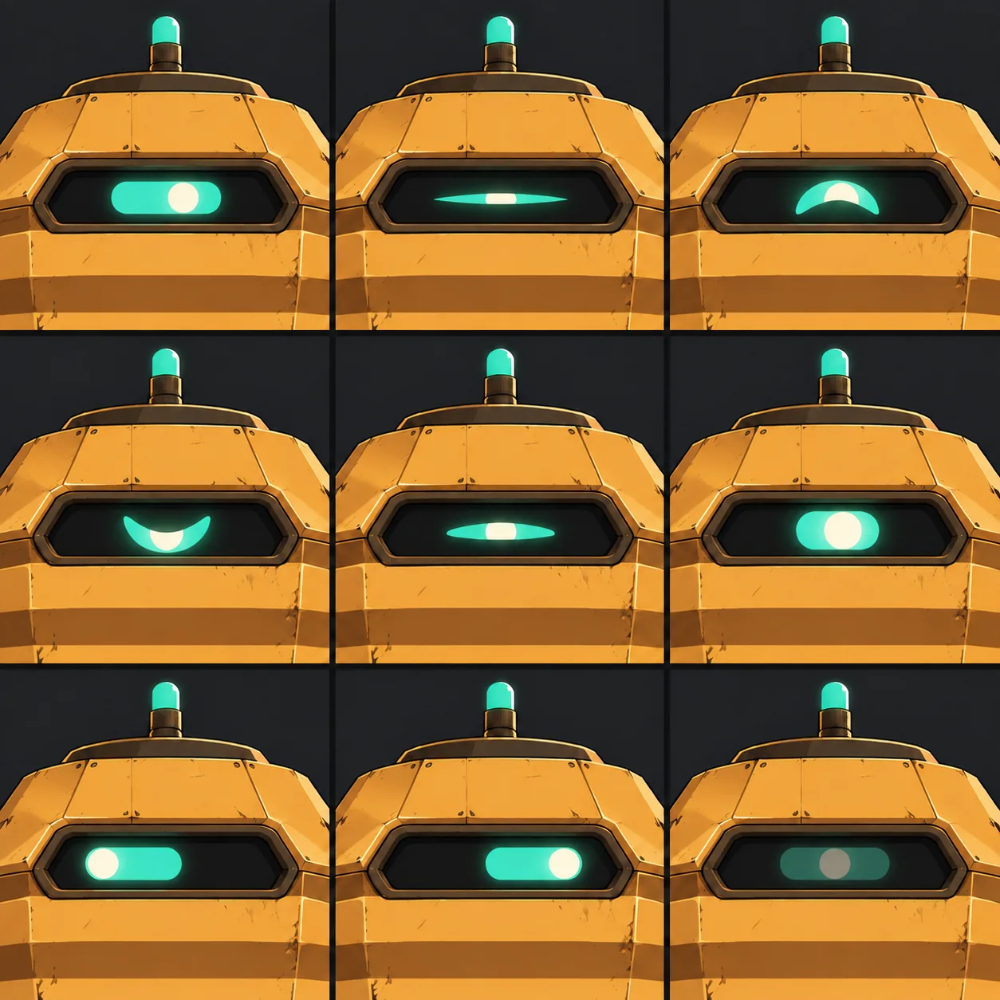
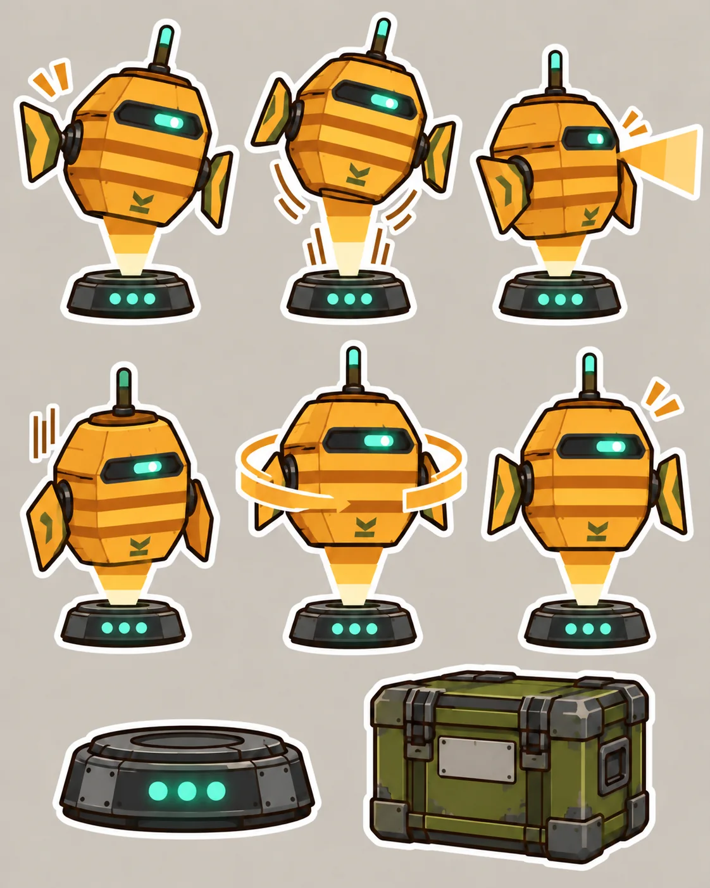
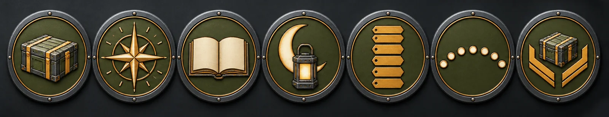

<p align="center">
  
</p>

<h1 align="center">FERRIN</h1>
<p align="center"><b>A salvage-refit shipboard intelligence for your Codex / ChatGPT desktop.</b><br>
Standing watch over your work, one manifest at a time.</p>

<p align="center">
  <a href="docs/character.md">Character</a> ·
  <a href="docs/lore.md">Lore</a> ·
  <a href="docs/commands.md">Commands</a> ·
  <a href="docs/events.md">Events</a> ·
  <a href="docs/gallery.md">Gallery</a> ·
  <a href="docs/visuals/README.md">Visual pipeline</a>
</p>

---

> *"Holding station, Skipper. All quiet on the manifest."*

FERRIN began as the cargo-manifest system of the survey frigate **RSV Longwake**. Forty years of field refits woke it up with opinions. Pulled from the wreck on a portable emitter puck, it now escorts one engineer, you, through **the Drift**. It keeps inventory of everything, including your unfinished tasks.

<p align="center">
  
</p>

## Install

1. Download `dist/ferrin.zip` and unzip it. It contains `pet.json`, `spritesheet.webp`, and `LICENSE`.
2. Copy the files into your pets folder:
   - macOS / Linux: `~/.codex/pets/ferrin/`
   - Windows: `%USERPROFILE%\.codex\pets\ferrin\`
   - Custom home: `<CODEX_HOME>/pets/ferrin/`
3. Open **Settings → Pets → Refresh**, then run `/pet` and choose **Ferrin**.

Selecting the pet changes its appearance only. It doesn't install tools or load the optional `$ferrin` skill (see [Commands](docs/commands.md)).

## Moods

The desktop app picks FERRIN's animation from what the agent is doing.

| Row | State | FERRIN mood |
|---|---|---|
| idle | Standing by | **Standing Watch** |
| running-right / left | Pet being moved | **Underway** |
| waving | Greeting | **Hail** |
| jumping | Flourish | **Short Burn** |
| failed | Blocked | **Casualty Report** |
| waiting | Needs input | **Awaiting Orders** |
| running | Working | **Plotting Solution** |
| review | Ready | **Debrief** |
| look 0–15 | Pointer tracking | **Tracking** |

<p align="center">
  
  
</p>

## Drift Ops

Thirty original commands and easter eggs live in the optional `$ferrin` / `/ferrin` skill and in the browser preview. They include status reports, crate-catch drills, a hidden 8-part log series, six secret **Ballast Tags**, and seven **Commendations**.

<p align="center">
  
</p>

```
$ferrin sitrep      → "Holds sealed, emitter warm, Skipper upright. Good ledger."
$ferrin scuttlebutt → "Why'd the relay quit? Nobody ever answered its calls."
$ferrin haul <task> → a three-crate manifest for whatever you're shipping
```

Full catalog: [docs/commands.md](docs/commands.md)

## Repository map

| Path | What it is |
|---|---|
| `pet.json`, `spritesheet.webp` | The desktop pet |
| `tools/` | Code-drawn sprite generator, atlas composer, validator |
| `skills/ferrin/` | Optional `$ferrin` persona skill |
| `preview/` | Browser preview with mood engine and Drift Ops |
| `docs/` | Character, lore, commands, events, gallery, visual pipeline |
| `dist/` | Release ZIPs |

## Credits and license

- Forked from [ruvnet/ruPet](https://github.com/ruvnet/ruPet) (MIT © 2026 ruvnet). See [ATTRIBUTION.md](ATTRIBUTION.md).
- The sprite atlas is drawn in code from `tools/ferrin_spec.py`.
- The illustrations in `docs/images/` are **AI-generated** from the prompts in [docs/visuals/prompts.md](docs/visuals/prompts.md). Provenance is recorded in [docs/images/manifest.json](docs/images/manifest.json).
- FERRIN, the Longwake, the Tidewater Compact, and the Drift are original to this project.
- Not an official OpenAI product.

MIT. See [LICENSE](LICENSE).
