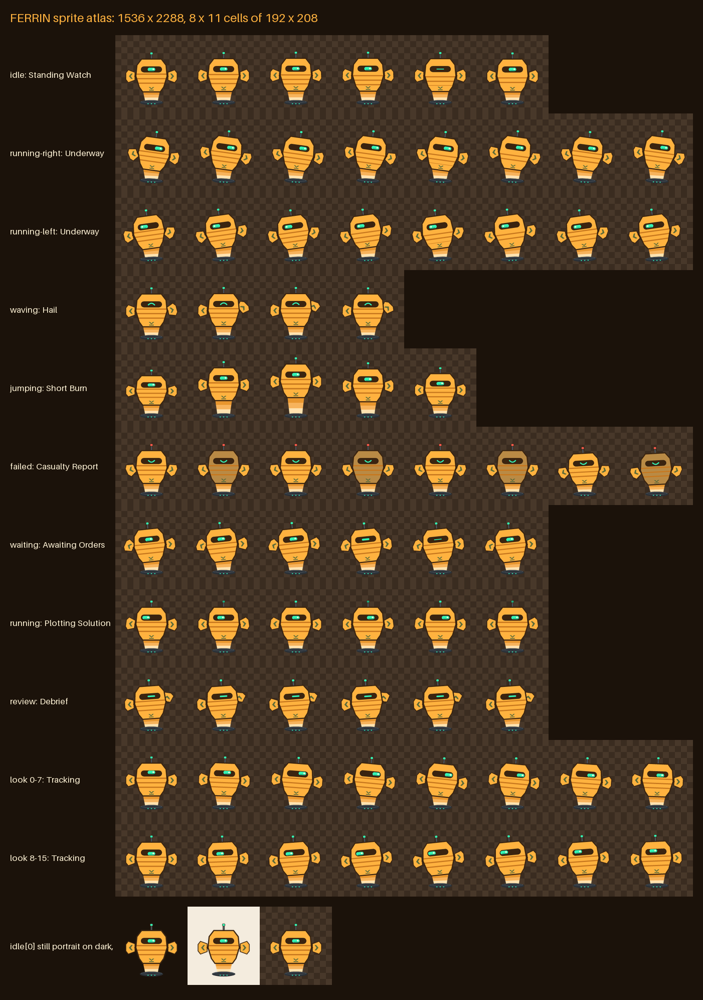

<p align="center">
  
</p>

<h1 align="center">FERRIN</h1>
<p align="center"><b>A salvage-refit shipboard intelligence for your Codex / ChatGPT desktop.</b><br>
Standing watch over your work, one manifest at a time.</p>

<p align="center">
  <a href="docs/character.md">Character</a> ·
  <a href="docs/lore.md">Lore</a> ·
  <a href="docs/commands.md">Commands</a> ·
  <a href="docs/events.md">Events</a> ·
  <a href="docs/gallery.md">Gallery</a> ·
  <a href="sfx/README.md">Sound</a> ·
  <a href="voice/README.md">Voice</a>
</p>

> *"Holding station, Skipper. All quiet on the manifest."*

FERRIN began as the cargo-manifest system of the survey frigate **RSV Longwake**. Forty years of field refits woke it up with opinions. Pulled from the wreck on a portable emitter puck, it now escorts one engineer, you, through **the Drift**. It keeps inventory of everything, including your unfinished tasks.

<p align="center">
  
</p>

## Install the pet

1. Download [`dist/ferrin.zip`](dist/ferrin.zip) and unzip it. It contains a `ferrin/` folder with `pet.json`, `spritesheet.webp` and `LICENSE`.
2. Copy that folder into your pets folder:
   - macOS / Linux: `~/.codex/pets/ferrin/`
   - Windows: `%USERPROFILE%\.codex\pets\ferrin\`
   - Custom home: `<CODEX_HOME>/pets/ferrin/`
3. Open **Settings > Pets > Refresh**, then run `/pet` and choose **Ferrin**.

Selecting the pet changes its appearance only. It doesn't install tools or load the optional `$ferrin` skill.

## Moods

The desktop app picks FERRIN's animation from what your agent is doing.

| Row | Host state | FERRIN mood |
|---|---|---|
| idle | Standing by | **Standing Watch** |
| running-right / left | Pet being moved | **Underway** |
| waving | Greeting | **Hail** |
| jumping | Flourish | **Short Burn** |
| failed | Blocked | **Casualty Report** |
| waiting | Needs input | **Awaiting Orders** |
| running | Working | **Plotting Solution** |
| review | Ready | **Debrief** |
| look 0 to 15 | Pointer tracking | **Tracking** |



## Try it in the browser

Every page runs from static files. Serve the repo locally with `python3 -m http.server` and open `http://localhost:8000/`, or turn on GitHub Pages (the included `pages` workflow deploys the repo root).

| Page | What it is |
|---|---|
| [`preview/`](preview/) | The pet plus **Drift Ops**: 31 commands, crate-catch and bearing drills, 8 hidden Longwake logs, 6 secret Ballast Tags, 7 commendations, dated events and a forgiving mood engine. |
| [`experience/`](experience/) | A WebGL study: FERRIN materializes, then the view moves through its capabilities, a blueprint, the acoustic emitter physics and the specs. |
| [`voice/`](voice/) | Talk to FERRIN. Push-to-talk speech in, browser speech out, offline banter by default. |
| [`sfx/`](sfx/) | Thirty synthesized sound cues with an audition board. |

## The `$ferrin` skill

Install [`dist/ferrin-skill.zip`](dist/ferrin-skill.zip) into your skills folder (for Codex, `~/.codex/skills/`). Then:

```
$ferrin sitrep      -> "Holds sealed, emitter warm, Skipper upright. Good ledger."
$ferrin scuttlebutt -> "Why'd the relay quit? Nobody ever answered its calls."
$ferrin haul <task> -> a three-crate checklist for whatever you're shipping
```

In Claude Code the same folder answers to `/ferrin`. The full catalog is in [docs/commands.md](docs/commands.md) and [skills/ferrin/references/commands.md](skills/ferrin/references/commands.md).

## Memory: the ship's log

The desktop pet itself can't remember anything; the host app owns it. FERRIN remembers you in two places, and you can always see, edit and erase what it keeps.

- **In your agent.** The `$ferrin` skill keeps a short Markdown file, `.ferrin/log.md` in a project or `~/.ferrin/log.md` everywhere else. It reads the file on each invocation and writes only durable facts you state or ask it to keep: your name, preferences, projects and milestones. It never writes secrets or sensitive details and says so in one line whenever it logs something. Use `$ferrin log`, `$ferrin remember <fact>`, `$ferrin forget <thing>` and `$ferrin wipe log`. Rules: [skills/ferrin/references/memory.md](skills/ferrin/references/memory.md).
- **In the browser.** The preview console and the voice page share one ship's log in `localStorage` (`shared/ferrin-memory.js`). Say "remember that...", "forget...", or "what do you remember?". The voice page has a panel to switch memory off, delete entries, export, import and wipe. It filters out anything that looks like a password, key or account number, and nothing leaves the browser.

Memory is never used to nag. Absence is shore leave.

## Repository map

| Path | What it is |
|---|---|
| `pet.json`, `spritesheet.webp` | The desktop pet (1536 x 2288 lossless WebP, 8 x 11 cells) |
| `tools/` | Code-drawn sprite pipeline: spec, renderer, composer, validator, previews, packager |
| `preview/` | Browser console; `preview/data/` is the single source of truth for commands, logs, tags and events |
| `skills/ferrin/`, `prompts/` | Optional persona skill and prompts |
| `experience/`, `voice/`, `sfx/` | 3D study, voice prototype, sound pack |
| `shared/` | The browser ship's log, shared by the preview and voice pages |
| `docs/` | Character, lore, commands, events, gallery, visual prompts, contact sheet |
| `scripts/`, `tests/` | Skill catalog generator, IP hash scan, dash gate, unit tests |
| `dist/` | Release ZIPs and checksums |

## Develop

Requires Python 3.10+ with Pillow (art pipeline only) and Node 20+ (tests and scripts).

```bash
make art       # draw frames, compose spritesheet.webp, rebuild previews
make verify    # atlas validator, unit tests, IP scan, dash gate
make package   # dist/ferrin.zip, dist/ferrin-skill.zip, dist/SHA256SUMS.txt
```

**IP guard.** Put the names you never want in the repo into a local `ip-denylist.txt` (git-ignored), then run `node scripts/ip-hash.mjs`. That writes `ip-denylist.sha256`, which holds hashes only. `make verify` and CI fail if any committed text matches.

## Credits and license

- Forked from [ruvnet/ruPet](https://github.com/ruvnet/ruPet) by Reuven Cohen (MIT © 2026 ruvnet). See [ATTRIBUTION.md](ATTRIBUTION.md).
- The sprite atlas is drawn in code from `tools/ferrin_spec.py`. The sound pack is synthesized in code from `sfx/tools/synth.py`.
- The illustrations in `docs/images/` are **AI-generated** from the prompts in [docs/visuals/prompts.md](docs/visuals/prompts.md), with provenance in [docs/images/manifest.json](docs/images/manifest.json).
- FERRIN, the Longwake, the Tidewater Compact and the Drift are original to this project.
- Not an official OpenAI product.

Code, the atlas and the pet package are MIT ([LICENSE](LICENSE)). Docs prose, lore, dialogue and audio are CC BY 4.0 ([LICENSE-CONTENT.md](LICENSE-CONTENT.md)).
