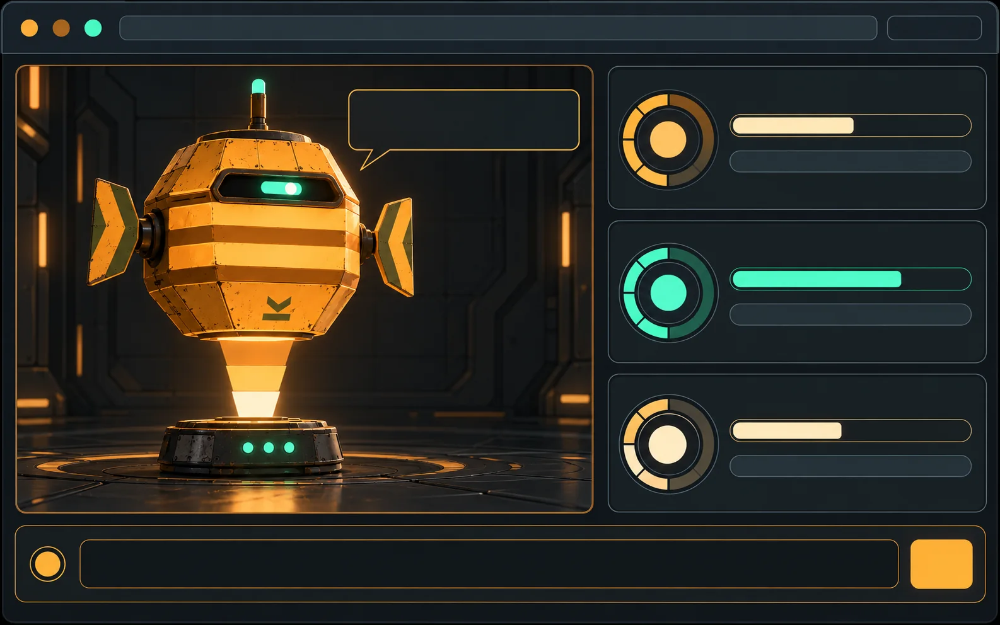
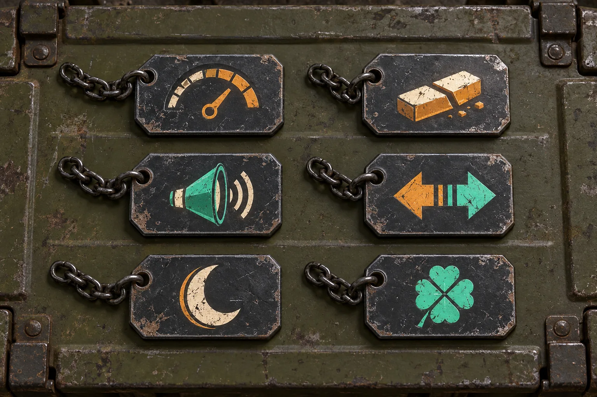

# Drift Ops · Commands & Easter Eggs

[← README](../README.md) · [Character](character.md) · [Lore](lore.md) · **Commands** · [Events](events.md) · [Gallery](gallery.md)

Commands run in two layers:

- **Skill layer.** `$ferrin <verb>` (Codex) or `/ferrin <verb>` (Claude Code) gives you FERRIN's words.
- **Preview layer.** `preview/index.html` handles the animation, key sequences, clicks, dates, and mini-games.

The desktop pet's animation always follows agent status. A skill reply can't change it.

## Everyday

| Command | What FERRIN does |
|---|---|
| `sitrep` | Status report with Power, Sync, and Morale |
| `hull` | Hull manifest |
| `navfix` | Current position in the Drift |
| `ward up` / `ward down` | Raise or drop the ward lattice (preview) |
| `hail` | Greeting |
| `scuttlebutt` | Jokes and rumours |
| `inspect` | Persona line, then an offer to run a real review |
| `thanks` | Logs gratitude under morale, surplus |
| `scrub` | Shakes off a failed build and never costs Morale |
| `haul <task>` | Turns a task into a three-item manifest |
| `muster` | Roll call of the Tenders |

## Mini-games (preview)

| Command | Game |
|---|---|
| `drop` | Catch falling crates with Space |
| `drill` | Match FERRIN's gaze with the arrow keys |
| `contact` | Answer a Murmur ping: `ward` or `dark` |

## Lore

`longwake` · `tidewater` · `salvage` · `logs` · `decrypt LW-0n`. See [Lore](lore.md).

## Recovered Longwake Logs

Eight hidden logs, LW-00 through LW-07. Each one hints at the next. Days of use count as *distinct days*, never streaks.

## Ballast Tags

Six secret modifiers. They are cosmetic or voice-only, they stack, and you toggle them with `ballast <name> on|off`.

| Tag | Glyph | Effect |
|---|---|---|
| Dead Reckoning | Gauge | Hides mood numbers; FERRIN describes them in words |
| Short Rations | Cut ration bar | Every line is 5 words or fewer |
| Loud Manifest | Loudspeaker | Stencil caps and manifest IDs |
| Mirror Watch | Mirrored arrows | Gaze mirrors the cursor |
| Night Cargo | Crescent moon | Dimmed, mint-only whisper mode |
| Lucky Ledger | Clover | Rare lines appear 3× as often |

*Where to find them is left for you to discover.*

## Commendations

| Badge | Commendation | Earned by |
|---|---|---|
| Crate | First Manifest | Running any command |
| Compass rose | Perimeter Clear | A secret key sequence |
| Open ledger | Logkeeper | Reading all 8 logs |
| Moon & lantern | Graveyard Watch | A late-night session |
| Stacked tags | Full Ballast | Finding all 6 Ballast Tags |
| Seven dots | Seven Ports of Call | 7 distinct days, any spacing |
| Crate in chevrons | Steady Catch | 5 crates in one `drop` run |

## Accessibility

The preview honours `prefers-reduced-motion` by showing static frames. Loops stop on their own within 5 seconds, a **Hold** button (hotkey `H`) pauses everything, and there's no audio by default.

## Ship's log (memory)

| Command | What FERRIN does |
|---|---|
| `log` | Shows what FERRIN remembers |
| `remember <fact>` | Adds one fact; refuses passwords, keys and account numbers |
| `forget <thing>` | Strikes every entry containing it |
| `wipe log` | Clears everything after `wipe log confirm` |

In your agent the skill keeps these in `.ferrin/log.md` or `~/.ferrin/log.md`. In the browser they live in `localStorage`, shared by the preview and voice pages.
