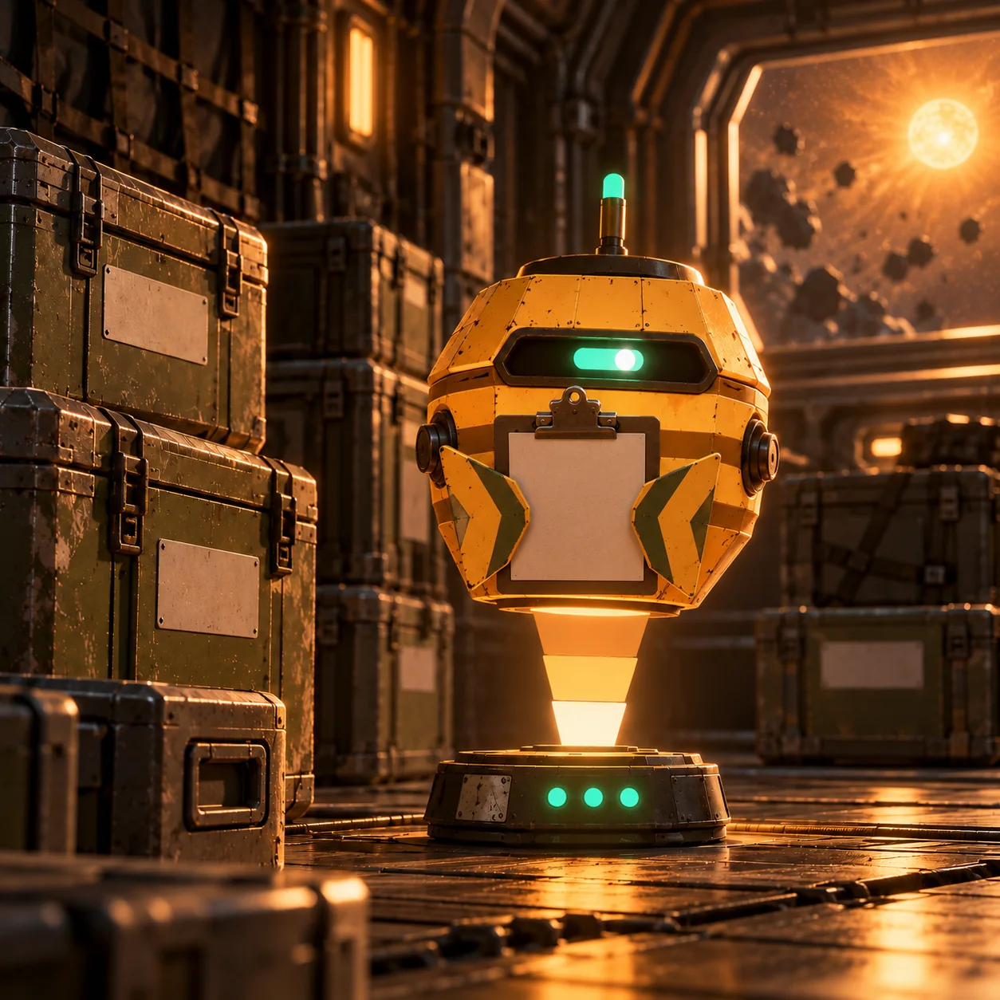
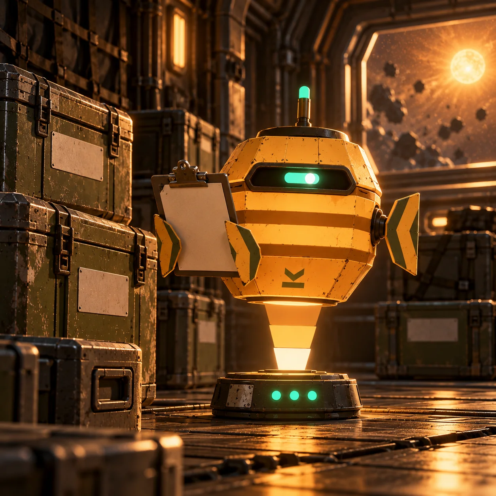

# Gallery

[← README](../README.md) · [Character](character.md) · [Lore](lore.md) · [Commands](commands.md) · [Events](events.md) · **Gallery**

Every illustration in this repo is **AI-generated** from [the prompt pack](visuals/prompts.md). Provenance, hashes, and QC results are in [`images/manifest.json`](images/manifest.json).

| Image | File · Prompt · Used on |
|---|---|
|  | `ferrin-hero-banner.webp` · FERRIN-VIS-001/F01 · readme |
|  | `ferrin-cargo-bay-clipboard.webp` · FERRIN-VIS-001/A01 · character |
|  | `ferrin-cargo-bay-inspect.webp` · FERRIN-VIS-001/A01 · character |
|  | `ferrin-sticker-sheet.webp` · FERRIN-VIS-001/D04 · character |
|  | `ferrin-eye-states.webp` · FERRIN-VIS-001/A03 · character |
|  | `event-manifest-mixup.webp` · FERRIN-VIS-001/E02 · events |
|  | `event-longwake-launch-day.webp` · FERRIN-VIS-001/E01 · events |
|  | `event-derelict-night.webp` · FERRIN-VIS-001/E03 · events |
|  | `ballast-tags.webp` · FERRIN-VIS-001/D03 · commands |
|  | `commendation-badges.webp` · FERRIN-VIS-001/D02 · commands |
|  | `ferrin-desktop-context.webp` · FERRIN-VIS-001/C03 · readme |
|  | `preview-console-mockup.webp` · FERRIN-VIS-001/C01 · commands |
|  | `lore-tenders-muster.webp` · FERRIN-VIS-001/B05 · lore |
|  | `lore-the-salvage.webp` · FERRIN-VIS-001/B03 · lore |
|  | `lore-the-murmur.webp` · FERRIN-VIS-001/B04 · lore |
|  | `lore-relay-kestrel-nine.webp` · FERRIN-VIS-001/B02 · lore |
