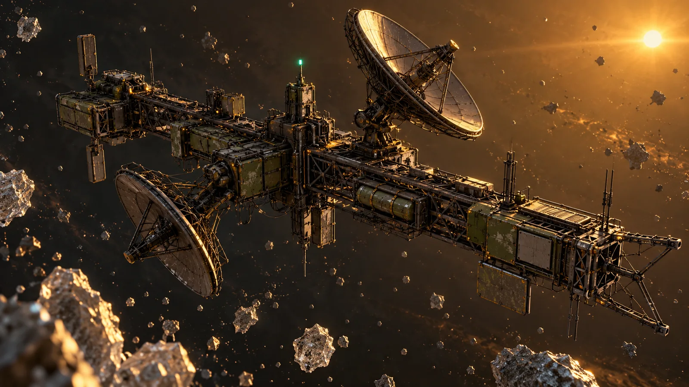
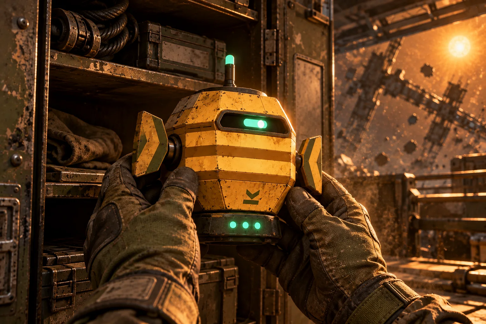
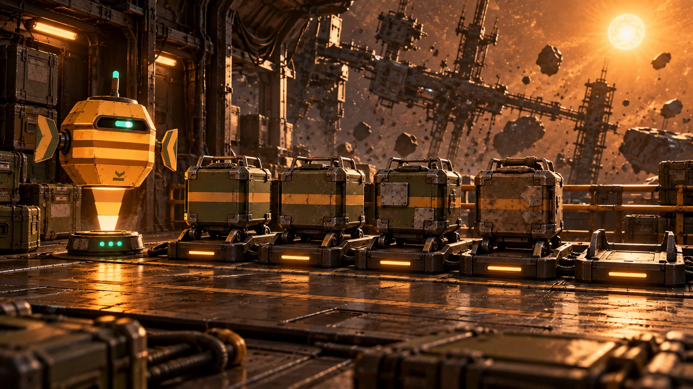
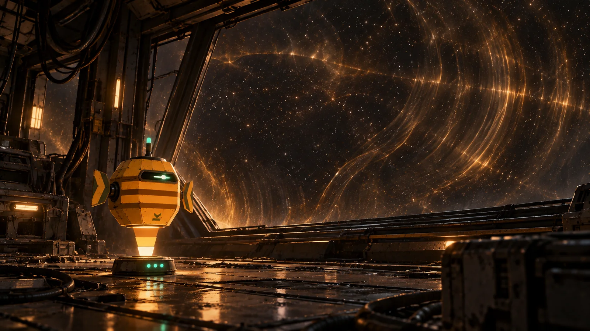

# The Drift · Lore

[← README](../README.md) · [Character](character.md) · **Lore** · [Commands](commands.md) · [Events](events.md) · [Gallery](gallery.md)

## The Tidewater Compact

The **Tidewater Compact** built ships to map, not to fight. Its **Pathfinder Service** sent survey frigates into **the Drift**, a sparse belt of derelict relay stations and survey debris under a distant amber star. Their job was to chart the relays and bring the data home.

## RSV Longwake

The survey frigate **RSV Longwake** carried forty-one crew, survey drones, rations, and hope. FERRIN was its cargo-manifest system. Field refit after field refit bolted on navigation and tactical modules until the manifest system started having opinions. When the Longwake went dark, the crew left by lifeboat. FERRIN stayed behind, counting crates.

> `$ferrin longwake`: "I counted crates aboard the Longwake. Then nobody came back."

## Relay Kestrel-Nine

A skeletal truss station whose dish still tracks slowly and whose mint beacon still blinks. It answered the Longwake's hail. Nobody aboard sent the reply.

> `$ferrin navfix`: "Holding off Relay Kestrel-Nine. Drift current mild."

## The Salvage

Eleven years later, a lone engineer pried open a relay locker and found the emitter puck. The three pips flickered on. The manifest updated: *crew, one.*

> `$ferrin salvage`: "You pulled me from a relay locker {n} days ago."

## The Tenders

Four boxy utility drones, each worn in its own way. The fifth cradle is empty. Tender Five is recharging, allegedly.

> `$ferrin muster`: "Tenders One through Four present. Five is recharging, allegedly."

## The Murmur

Something passes through the Drift below the threshold of hearing. Nobody has seen it. The crates rattle when it goes by. When FERRIN hears it, the lantern narrows to a sliver and it runs dark.

> `$ferrin contact`: "Murmur ping, bearing two-seven-zero. Ward or go dark?"

## Recovered Longwake Logs

Eight water-damaged logs are hidden in the preview. You unlock them by exploring, never by grinding. See [Commands → Logs](commands.md#recovered-longwake-logs).
